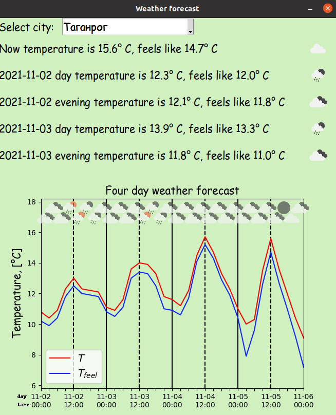

# Description:
The program for determining the weather in Russian cities.


# Working with source code:
1) Sign up and generate API key: https://home.openweathermap.org/api_keys
2) Create API.txt in the directory of the py file and insert the API key into it
3) For the correct work of the source, execute: 
* ```pip3 install lxml```
* ```sudo apt install font-manager```
* ```sudo apt-get install msttcorefonts -qq```


